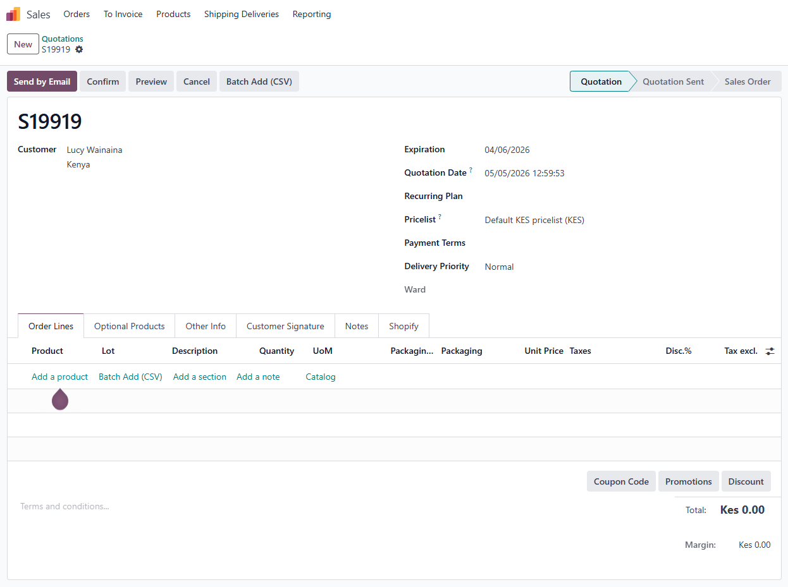
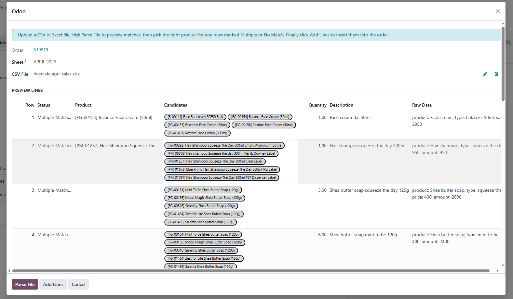

# 🚀 Batch Add (CSV) - Supercharge Your Odoo Imports!

<div align="center">

[](https://www.odoo.com/)
[](https://opensource.org/licenses/LGPL-3.0)
[](https://www.python.org/)
[](https://github.com/fractal-solutions/batch_add/graphs/commit-activity)
[](https://github.com/fractal-solutions/batch_add/pulls)

**Transform CSV chaos into Odoo order!** 📊✨

*Batch import product lines with AI-powered fuzzy matching - because manual entry is so 2020*

[📖 Table of Contents](#-table-of-contents) • [🚀 Quick Start](#-installation) • [📸 Screenshots](#-screenshots) • [🤝 Contributing](#-contributing)

</div>

---

## 📋 Table of Contents

- [🎯 Features](#-features)
- [📋 Supported Documents](#-supported-documents)
- [⚡ Installation](#-installation)
- [🔧 Dependencies](#-dependencies)
- [📖 Usage](#-usage)
- [📄 CSV Format](#-csv-format)
- [⚙️ Configuration](#️-configuration)
- [🔗 Compatibility](#-compatibility)
- [📸 Screenshots](#-screenshots)
- [🔧 Troubleshooting](#-troubleshooting)
- [🤝 Contributing](#-contributing)
- [🆘 Support](#-support)
- [📜 License](#-license)
- [🙏 Credits](#-credits)

---

## 🎯 Features

<div align="center">

| ✨ Feature | 🎯 Benefit |
|------------|------------|
| **🔍 Multi-Document Support** | Works with Sales Orders, Purchase Orders, Inventory Operations & Manufacturing Orders |
| **🎨 Flexible CSV Parsing** | Accepts various column headers and formats - no more rigid templates! |
| **🧠 Intelligent Matching** | Combines exact SKU/barcode matching with fuzzy name matching |
| **👥 User-Friendly Interface** | Preview and correct matches before importing - no surprises! |
| **🚨 Smart Error Handling** | Clear feedback for unmatched or ambiguous products |

</div>

> **💡 Pro Tip**: The AI-powered fuzzy matching can find "Wireless Mouse" even if your CSV says "wireless mouse bluetooth"!

---

## 📋 Supported Documents

<div align="center">

| 📄 Document Type | 🎯 Target Lines | 🚀 Status |
|------------------|-----------------|-----------|
| **🛒 Sales Orders** | Order Lines | ✅ Active |
| **📦 Purchase Orders** | Order Lines | ✅ Active |
| **📦 Inventory Operations** | Operations (Receipts/Deliveries/Internal) | ✅ Active |
| **🏭 Manufacturing Orders** | Components (Raw Materials) | ✅ Active |

</div>

---

## ⚡ Installation

> **⏱️ Time Estimate**: 2 minutes

### Option 1: Git Clone (Recommended)
```bash
cd /path/to/your/odoo/addons
git clone https://github.com/fractal-solutions/batch_add.git
```

### Option 2: Manual Download
1. 📥 Download the ZIP from [Releases](https://github.com/fractal-solutions/batch_add/releases)
2. 📂 Extract to your Odoo addons directory
3. 🔄 Restart Odoo and update apps list

### Final Steps
```bash
# Install via command line
odoo -i batch_add

# Or install via Odoo interface:
# Apps → Update Apps List → Search "Batch Add" → Install
```

🎉 **Done!** Your module is ready to rock! 🤘

---

## 🔧 Dependencies

This module requires these Odoo core modules:

<div align="center">

| 🔗 Module | 📋 Purpose |
|-----------|------------|
| `sale` | Sales order management |
| `purchase` | Purchase order management |
| `stock` | Inventory and warehouse operations |
| `mrp` | Manufacturing operations |
| `web` | Web interface components |

</div>

> **✅ Auto-installed** with standard Odoo setups

---

## 📖 Usage

<div align="center">

### 🎬 Quick Demo
*Watch the magic happen in 30 seconds!*

</div>

### Step-by-Step Guide

1. **📂 Open Your Document**
   - Sales Order, Purchase Order, Stock Picking, or Manufacturing Order

2. **🔍 Find the Magic Button**
   - Look for the **🚀 Batch Add (CSV)** button above product lines

3. **📤 Upload Your File**
   - Click the button → Upload `.csv`, `.xls`, or `.xlsx`
   - *Pro tip: Excel files support multiple sheets!*

4. **🔍 Parse & Preview**
   - Click **🔍 Parse File** to see the magic
   - Review matches:
     - 🟢 **Exact Match**: Found via SKU/barcode
     - 🟡 **Fuzzy Match**: Found via smart name matching
     - 🟠 **Multiple Matches**: Choose the right product
     - 🔴 **No Match**: Manual selection needed

5. **✅ Import**
   - Adjust quantities if needed
   - Click **✅ Add Lines** and watch the lines appear!

> **⚡ Lightning Fast**: Import hundreds of lines in seconds, not hours!

---

## 📄 CSV Format

<div align="center">

### 🎯 Smart Column Detection
*Our AI automatically detects your columns - but here's how to make it perfect!*

</div>

### 🏷️ Recommended Columns

#### Product Identification (Pick at least one!)
- **`sku`, `code`, `item code`, `product code`** → Matches Odoo's `default_code`
- **`barcode`** → Matches product barcode
- **`name`, `product`, `description`** → Used for fuzzy matching

#### Quantity (Optional - defaults to 1)
- Any header with: `qty`, `quantity`, `qtty`, `amount`, `count`

### 📊 Example Files

#### 🔥 Minimal (SKU Power)
```csv
sku,qty
PROD-001,5
PROD-002,10
```

#### 🎨 Creative (Name Matching)
```csv
name,quantity
Wireless Bluetooth Mouse,3
Premium USB Cable 2m,7
```

#### 🚀 Comprehensive (All Features)
```csv
product_code,name,barcode,quantity,notes
PROD-001,Wireless Mouse,123456789,3,"Best seller"
PROD-002,USB Cable 2m,987654321,7,"Bulk pack"
```

> **🎭 Flexible AF**: Mix and match columns - our parser is smarter than your average bear! 🐻

---

## ⚙️ Configuration

<div align="center">

### 🎛️ Zero Config Required!
*Just install and go - it integrates seamlessly with your existing workflows*

</div>

- ✅ **No database changes**
- ✅ **No system settings**
- ✅ **No user permissions needed**
- ✅ **Works with all Odoo themes**

---

## 🔗 Compatibility

<div align="center">

| 🔧 Spec | 📋 Details |
|---------|------------|
| **Odoo Version** | 18.0 ✅ |
| **Python** | 3.10+ ✅ |
| **License** | LGPL-3 ✅ |
| **Browser Support** | All modern browsers ✅ |

</div>

---

## 📸 Screenshots

<div align="center">

### 🖱️ The Magic Button Appears!


### 🎯 Import Dialog & Smart Preview


*See the AI matching in action! 🔍✨*

</div>

---

## 🔧 Troubleshooting

<div align="center">

### 🚨 Common Issues & Fixes

</div>

| 😵 Problem | 🔍 Cause | 💡 Solution |
|------------|----------|-------------|
| **No products found** | Unrecognizable identifiers | Add SKU/barcode or use exact product names |
| **Multiple matches** | Ambiguous names | Add SKU column or be more specific |
| **Wrong quantities** | Unrecognized headers | Use `qty`, `quantity`, or similar keywords |
| **File upload fails** | Wrong format | Use `.csv`, `.xls`, or `.xlsx` files |

### 📁 File Format Tips

<div align="center">

| ✅ Do | ❌ Don't |
|-------|----------|
| Save Excel as `.xlsx` | Use `.xlsm` or macros |
| Use UTF-8 encoding | Use special characters in headers |
| Remove extra header rows | Include merged cells |
| Test with small files first | Upload 10,000+ rows initially |

</div>

---

## 🤝 Contributing

<div align="center">

### 🌟 We Love Contributors!

</div>

We welcome all contributions! Here's how to get involved:

1. **🍴 Fork** the repository
2. **🌿 Create** a feature branch (`git checkout -b feature/amazing-idea`)
3. **💻 Code** your magic
4. **✅ Test** thoroughly
5. **📝 Commit** with clear messages
6. **🔄 Push** and create a PR

### 🐛 Found a Bug?
- 🐛 [Open an Issue](https://github.com/fractal-solutions/batch_add/issues)
- 🏷️ Use bug report template
- 📸 Include screenshots if possible

### 💡 Have an Idea?
- 💡 [Open a Feature Request](https://github.com/fractal-solutions/batch_add/issues)
- 🏷️ Use enhancement label
- 📝 Describe the use case

---

## 🆘 Support

<div align="center">

### 📞 Get Help Fast!

</div>

| 📋 Support Type | 🚀 Response Time | 📍 Where |
|-----------------|------------------|----------|
| **🐛 Bug Reports** | 24-48 hours | [GitHub Issues](https://github.com/fractal-solutions/batch_add/issues) |
| **💡 Feature Requests** | 1-2 days | [GitHub Discussions](https://github.com/fractal-solutions/batch_add/discussions) |
| **📧 General Questions** | 1-3 days | [GitHub Discussions](https://github.com/fractal-solutions/batch_add/discussions) |
| **💰 Commercial Support** | Contact author | jeremy.mumia@email.com |

**👨‍💻 Author**: [Jeremy Mumia](https://github.com/fractal-solutions)

---

## 📜 License

<div align="center">

**Licensed under [LGPL-3](https://opensource.org/licenses/LGPL-3.0)**

*Free for personal and commercial use! 🎉*

</div>

---

## 🙏 Credits

<div align="center">

### 🏆 Built with ❤️ by the Odoo Community

**Author**: [Jeremy Mumia](https://github.com/fractal-solutions)

**Inspired by**: Countless Odoo users who hate manual data entry

**Special Thanks**: Odoo Community for the amazing framework!

---

<div align="center">

### 🎯 Ready to Supercharge Your Odoo Workflow?

**[🚀 Install Now](#-installation)** • **[⭐ Star the Repo](https://github.com/fractal-solutions/batch_add)** • **[📣 Share with Friends](https://twitter.com/intent/tweet?text=Check%20out%20this%20awesome%20Odoo%20module!%20https://github.com/fractal-solutions/batch_add)**

---

*Made with ❤️ and lots of ☕ for the Odoo community*

</div>

</div>

- **Author**: Jeremy Mumia
- **Inspired by**: Various Odoo community import tools

---

*This module is not officially affiliated with Odoo S.A. Use at your own risk.*

